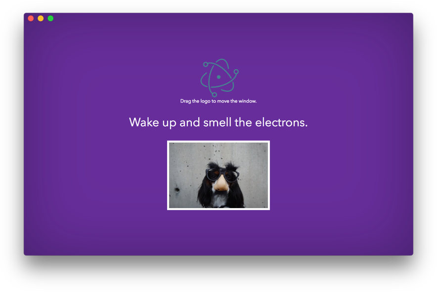

# electron-starter

This is a electron starter kit from some random guy on the Internet.

[Check out the docs](https://skellock.github.io/electron-starter) for all the gory details.

# example

It's not much to look at really. Just a barebones boilerplate. You need to bring your own awesome.

